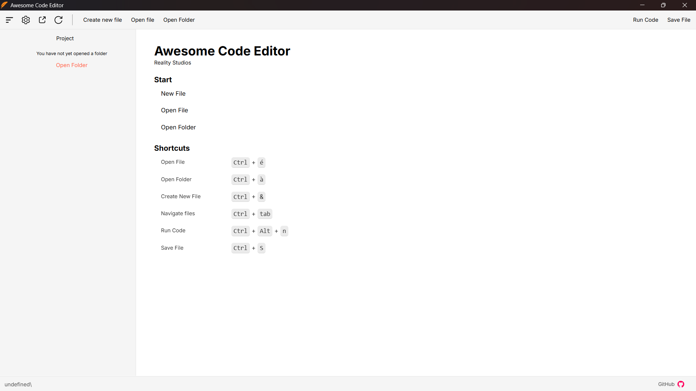
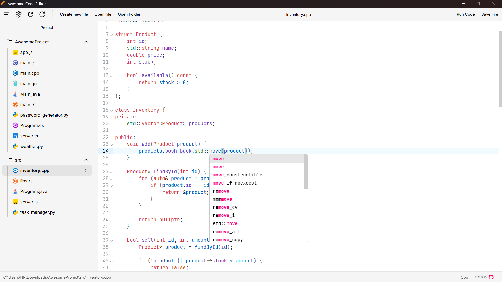
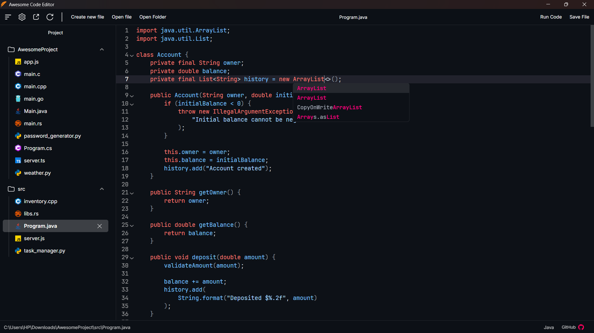

# ACE — Awesome Code Editor

> ⚠️ ACE is currently in development and has not reached version 1.0 yet.

ACE is a lightweight and modern code editor for Windows, built to be fast, simple, and easy to use.

## 📸 Screenshots

### Editor





## ✨ Features

* ⚡ Fast and lightweight desktop app
* 📝 Code editing powered by CodeMirror 6
* 📁 File and folder explorer
* 🔍 Open and manage multiple files
* 💾 Save files directly from the editor
* 💡 Autocomplete for many programming languages
* 🎨 Multiple editor themes
* ⌨️ Keyboard shortcuts
* ⚠️ Warning before closing with unsaved changes
* 🔄 Refresh the application without closing it
* 🖥️ Native desktop application
* 🌐 Support for many programming languages

### Supported languages

ACE currently includes support for languages such as:

* JavaScript
* TypeScript
* HTML
* CSS
* C
* C++
* C#
* Java
* Python
* Rust
* PHP
* And more through CodeMirror

## 🛠️ Tech Stack

ACE is built using:

* **Svelte 5** — frontend
* **Tauri v2** — desktop application
* **Rust** — backend and native functionality
* **CodeMirror 6** — code editor
* **TypeScript** — application logic
* **Vite** — development and build tool

## 📦 Requirements

Before running ACE from source, make sure you have installed:

* [Node.js](https://nodejs.org/)
* [Rust](https://www.rust-lang.org/)

## 🚀 Getting Started

Clone the repository:

```bash
git clone https://github.com/codeyahya/ace.git
cd ace
```

### Install dependencies

```bash
npm install
```

### Run in development mode

```bash
npm run tauri dev
```

### Build for production

```bash
npm run tauri build
```

The built application will be available in the Tauri build output directory.

## ⌨️ Keyboard Shortcuts

| Shortcut             | Action                      |
| -------------------- | --------------------------- |
| `Ctrl + S`           | Save file                   |
| `Ctrl + Tab`         | Switch between open files   |
| `Ctrl + Shift + Tab` | Switch to the previous file |
| `Ctrl + B`           | Toggle file explorer        |
| `Ctrl + R`           | Refresh                     |
| `Ctrl + F5`          | Refresh                     |

> Some shortcuts may change while ACE is still in development.

## 🎯 Project Goals

ACE is mainly focused on being:

* **Lightweight** — use fewer resources than large IDEs.
* **Fast** — open quickly and stay responsive.
* **Simple** — keep the interface clean and easy to understand.
* **Modern** — use modern web and native technologies.
* **Useful** — provide the features needed for everyday coding.

## 🗺️ Roadmap

ACE is still being developed. Planned improvements include:

* [ ] More language support
* [ ] Better file and folder management
* [ ] File search
* [ ] More editor features
* [ ] More themes
* [ ] Performance improvements
* [ ] More settings and customization

## 🤝 Contributing

ACE is an open-source project. Contributions, bug reports, and suggestions are welcome.

If you find a bug or have an idea for a new feature, feel free to open an issue.

## 📄 License

ACE is released under the MIT License.

## 🙏 Acknowledgements

* [CodeMirror](https://codemirror.net/) for the code editor engine.
* [Svelte](https://svelte.dev/) for the frontend framework.
* [Tauri](https://tauri.app/) for the desktop application framework.
* [Rust](https://www.rust-lang.org/) for the native backend.

---

README generated with ChatGPT
